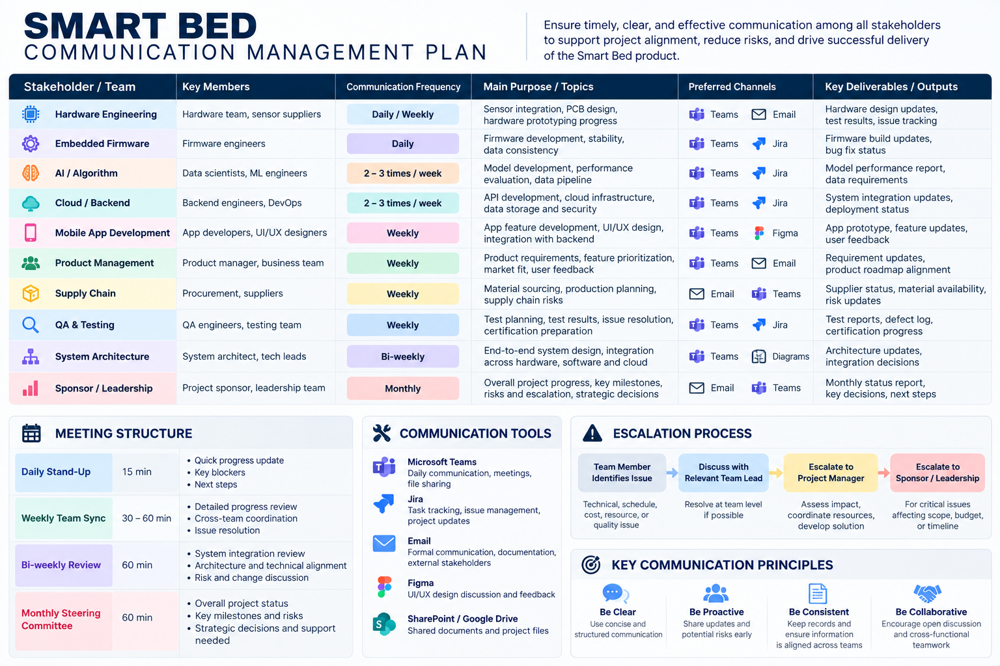

# Smart Bed Product Strategy & Project Management

## Project Overview

This team project developed a comprehensive product strategy and project management plan for an AI-powered smart bed integrating multi-sensor technology, sleep analytics, cloud infrastructure, and a mobile application.

The project covers the full product development lifecycle—from initial research and product design through hardware/software development, testing, certification, production, and product launch.

**Project Type:** Team Project  
**Focus:** Project Management | Product Strategy | Health Tech  
**Product:** AI-Powered Smart Bed  
**Project Horizon:** 12 Months

---

## Project Objective

The goal of the project was to design a smart bed solution that combines multi-sensor technology with AI-driven sleep analytics to provide personalized sleep insights while developing a realistic plan for bringing the product from concept to market.

The proposed system integrates:

- Multi-sensor sleep monitoring
- Embedded firmware
- AI-based sleep analytics
- Cloud infrastructure
- Mobile application
- Personalized sleep reporting

---

## My Contributions

My primary responsibilities focused on **project scheduling and communication management**, with additional participation in overall project planning and cross-functional coordination.

### Project Schedule & Roadmap
- Developed the 12-month project schedule
- Organized activities into five major development phases
- Coordinated dependencies across product design, hardware, software, testing, certification, and production
- Connected major project activities with key milestones and launch objectives

### Communication Management
- Developed the cross-functional communication plan
- Defined communication frequency for engineering, AI, cloud, product, supply chain, QA, and leadership teams
- Established daily, weekly, bi-weekly, and monthly communication cadences
- Designed escalation and information-sharing approaches to support project alignment

### Cross-Functional Project Planning
- Participated in overall project planning and team coordination
- Helped align project activities with the Work Breakdown Structure (WBS)
- Contributed to maintaining consistency across different project management areas

---

# Key Project Deliverables

## 1. 12-Month Project Roadmap

The project roadmap organizes the Smart Bed development lifecycle into five major phases:

1. Research & Concept
2. Product & Technical Design
3. Hardware & Software Development
4. Testing, Certification & Pilot Production
5. Mass Production & Launch

The roadmap highlights dependencies between product design, hardware development, firmware, AI analytics, cloud infrastructure, mobile development, testing, and production.

---

## 2. Communication Management Plan

A structured communication framework was developed to coordinate the multiple technical and business teams involved in the project.

The plan establishes different communication cadences based on team responsibilities, ranging from daily engineering coordination to monthly leadership reporting.

Key communication mechanisms include:

- Daily engineering stand-ups
- Weekly cross-functional meetings
- Bi-weekly technical reviews
- Project status tracking
- Risk and issue escalation
- Monthly leadership updates

---

## 3. Work Breakdown Structure (WBS)

The team developed a multi-level Work Breakdown Structure to decompose the Smart Bed project into manageable work packages across the complete product lifecycle.

Major workstreams include:

- Project planning and management
- Product design and requirements
- Hardware development
- Firmware and AI development
- Cloud and mobile application development
- Testing and certification
- Manufacturing and product launch
- Post-launch operations

---

## Additional Team Project Areas

The broader team project also addressed:

- Scope Management
- Stakeholder Management
- Procurement Management
- Resource Planning
- Cost Management
- Risk Management
- Quality Management
- Product and System Architecture
- Manufacturing and Operations

These components were integrated into a comprehensive project management framework for bringing the Smart Bed concept from initial research through commercialization.

---

## Key Project Insights

- Cross-functional coordination is critical when hardware, software, AI, and product teams operate on interdependent schedules.
- Communication frequency should vary based on stakeholder responsibilities and project dependencies.
- Early prototype development and testing can reduce downstream technical and schedule risks.
- Project schedules should account for certification, procurement, testing, and manufacturing—not only product development.
- Complex technology products require alignment between technical feasibility, business objectives, and execution planning.

---

## Full Project Report

📄 [View the Full Smart Bed Project Report](report/Smart_Bed_Project_Report.pdf)

---

## Skills Demonstrated

`Project Management` `Project Scheduling` `Communication Management` `WBS` `Cross-Functional Coordination` `Stakeholder Management` `Risk Management` `Product Strategy` `Health Tech`
